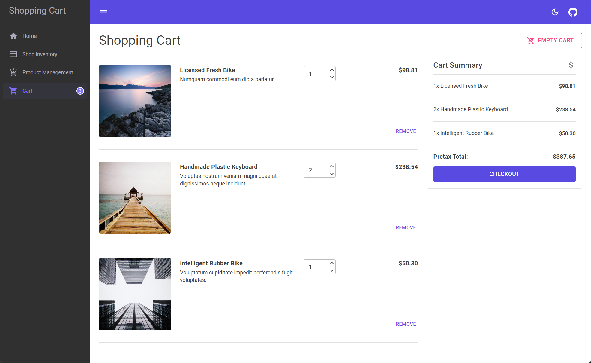

# Akka.NET: Shopping Cart App

A canonical shopping cart sample application, built using Akka.NET. This app shows the following features:

- **Shopping cart**: A simple shopping cart application that uses Akka.NET for its cross-platform framework support, and its scalable distributed applications capabilities.

    - **Inventory management**: Edit and/or create product inventory.
    - **Shop inventory**: Explore purchasable products and add them to your cart.
    - **Cart**: View a summary of all the items in your cart, and manage these items; either removing or changing the quantity of each item.

## Features

- [.NET 6](https://docs.microsoft.com/dotnet/core/whats-new/dotnet-6)
- [Docker](https://www.docker.com/products/docker-desktop/)
- [ASP.NET Core Blazor](https://docs.microsoft.com/aspnet/core/blazor/?view=aspnetcore-6.0)
- [Akka.NET: Akka.Persistence](https://getakka.net/articles/persistence/architecture.html)
    - [Azure Storage persistence](https://github.com/petabridge/Akka.Persistence.Azure/)
- [Akka.NET: Akka.Management](https://github.com/akkadotnet/Akka.Management/)
    - [Akka.Management.Cluster.Bootstrap](https://github.com/akkadotnet/Akka.Management/tree/dev/src/cluster.bootstrap/Akka.Management.Cluster.Bootstrap)
    - [Akka.Discovery.Azure](https://github.com/akkadotnet/Akka.Management/tree/dev/src/discovery/azure/Akka.Discovery.Azure)
- [Azure Bicep](https://docs.microsoft.com/azure/azure-resource-manager/bicep)
- [Azure Container Apps](https://docs.microsoft.com/en-us/azure/container-apps/overview)

The app is architected as follows:

## Get Started

### Prerequisites

- Have [Docker](https://www.docker.com/products/docker-desktop/) installed
- A [GitHub account](https://github.com/join)
- The [.NET 6 SDK or later](https://dotnet.microsoft.com/download/dotnet)
- The [Azure CLI](https://docs.microsoft.com/en-us/cli/azure/install-azure-cli)
- A .NET integrated development environment (IDE)
    - Feel free to use the [Visual Studio IDE](https://visualstudio.microsoft.com) or the [Visual Studio Code](https://code.visualstudio.com)

### Quickstart

1. `git clone git@github.com:petabridge/azure-container-app-akkadotnet.git akka-on-container-apps`
2. `cd akka-on-container-apps`
3. `dotnet run --project src\Akka.ShoppingCart\Akka.ShoppingCart.csproj`

## Deploying To Azure Container Apps

### Create a Resource Group

Before deploying the app, you need to create an Azure Resource Group (or you could choose to use an existing one). To create a new Azure Resource Group, use one of the following articles:

- [Azure Portal](https://docs.microsoft.com/en-us/azure/azure-resource-manager/management/manage-resource-groups-portal#create-resource-groups)
- [Azure CLI](https://docs.microsoft.com/en-us/azure/azure-resource-manager/management/manage-resource-groups-cli#create-resource-groups)
- [Azure PowerShell](https://docs.microsoft.com/en-us/azure/azure-resource-manager/management/manage-resource-groups-powershell#create-resource-groups)

### Prepare For Azure Deployment

In this tutorial, we will be using Azure CLI and Azure Bicep to create all of the resources needed by the example project and to deploy the Docker container into Azure Container Apps.

### Provision Required Azure Resources

We will use PowerShell, Azure CLI, and the provided .bicep files to automate our Azure resource creation. A convenience PowerShell script _deploy.ps1_ is available to deploy the whole stack in one go.

The _deploy.ps1_ file will:

* Prompt you for a unique name for your Azure Container Apps
* Prompt you for the Azure Resource Group to deploy to
* Prompt you for the location to deploy the resources
* Launch `az login` for you to log in to your Azure account
* Flex the _acr.bicep_ file to deploy an Azure Container registry
* Login Docker to Azure Container Registry
* Builds a Docker image for the sample project
* Push the Docker image to Azure Container registry
* Flex the _main.bicep_ file to provision:
  * Azure Storage account
  * Azure Application Insight
  * Azure Log Analytics workspace
  * Azure Container Apps Environment
  * Azure Container App

## Explore The Bicep Templates

The Bicep files used in this example is nearly identical to the one used in the [Orleans example](https://docs.microsoft.com/en-us/dotnet/orleans/deployment/deploy-to-azure-container-apps#explore-the-bicep-templates).

To read more about the Bicep files and how they are used in resource provisioning, please read the [documentation](https://docs.microsoft.com/en-us/dotnet/orleans/deployment/deploy-to-azure-container-apps#explore-the-bicep-templates). 

## Acknowledgements

The Akka.ShoppingCart project uses the following 3rd party open-source projects:

- [MudBlazor](https://github.com/MudBlazor/MudBlazor): Blazor Component Library based on Material design.
- [Bogus](https://github.com/bchavez/Bogus): A simple fake data generator for C#, F#, and VB.NET.
- [Blazorators](https://github.com/IEvangelist/blazorators): Source-generated packages for Blazor JavaScript interop.

Derived from: 
- [Azure-Samples/orleans-blazor-server-shopping-cart-on-container-apps](https://github.com/Azure-Samples/orleans-blazor-server-shopping-cart-on-container-apps).
- [IEvangelist/orleans-shopping-cart](https://github.com/IEvangelist/orleans-shopping-cart).
